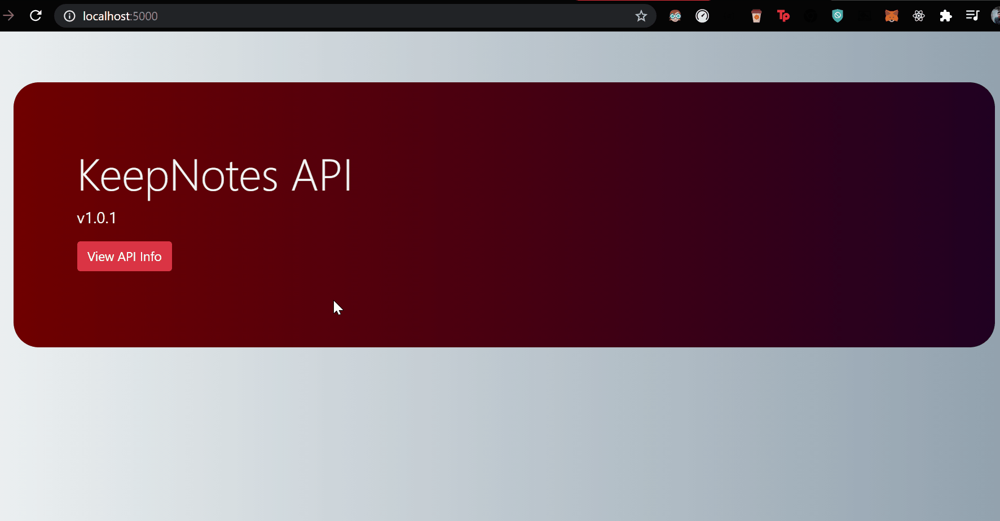

# KeepNotes REST API

**API** for web applications which stores notes. This **CRUD API** is built using [Node](https://nodejs.org/en/) and [Express](https://expressjs.com/) and fetches data from [MongoDB](https://www.mongodb.com/).

[](https://GitHub.com/Naereen/StrapDown.js/graphs/commit-activity)
[](https://GitHub.com/Naereen/ama)
[](https://code.visualstudio.com/)
[](https://GitHub.com/saswatamcode/mern-quick-notes-api/issues/)

---

## Installation

- **Install All Dependencies**
  ```sh-session
      npm install --save
      OR
      npm i --save
  ```
- **Create a `.env` file and add local or cloud (ATLAS) DataBase Connection URI**

  ```sh-session
     DB_URL='mongodb://localhost:27017/<collectionName>'

     COLLECTION='<collectionName>'
  ```

- **Run the Development Server**
  ```sh-session
      npm run dev
  ```

* **Visit `http://localhost:5000/`**

---

## Preview



---

## Routes

- > **Home : `localhost:5000/`**
- > **View all the notes `localhost:5000/api/`**
- > **Add new note `localhost:5000/api/newnote`**
- > **Update a note `locahost:5000/api/notes/:noteId`**
- > **Delete a note `localhost:5000/api/notes/:noteId`**

---

## [Application Info](https://github.com/akashchouhan16/KeepNotes_API "View API")

### Version

**[1.0.0](https://github.com/akashchouhan16/KeepNotes_API "API Version")**

### License

**[MIT](https://github.com/akashchouhan16/KeepNotes_API/blob/main/LICENSE "API LICENSE")**

> All rights reserved. Copyright (c) **Akash Chouhan**.

[](https://forthebadge.com)
[](https://forthebadge.com)
